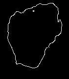

# VeinDeep

Developed as UNSW Thesis project. The application is a Biometric authentication that utilises an Intel Realsense SR300 Infrared Camera. Written in C++ but in C style lmao.

**Canny Edge Detection**

**Reference Image**

**Sample Output**
`Reading in references:1->2->3->4->5->done
Converting references:1->2->3->4->5->done
s 1 = 1099.041790, s 2 = 1181.144558, s 3 = 974.206424 | similarity score = 331.773499 s 1 = 1443.388280, s 2 = 1181.144558, s 3 = 951.289207 | similarity score = 721.954423 s 1 = 965.640241, s 2 = 1181.144558, s 3 = 830.165935 | similarity score = 486.452929 s 1 = 806.774779, s 2 = 1181.144558, s 3 = 597.769529 | similarity score = 792.380279 s 1 = 1067.199293, s 2 = 1181.144558, s 3 = 767.998929 | similarity score = 712.345992 The vein patterns match!`
